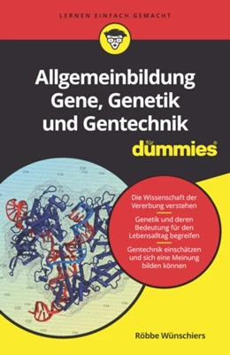

---
#
# By default, content added below the "---" mark will appear in the home page
# between the top bar and the list of recent posts.
# To change the home page layout, edit the _layouts/home.html file.
# See: https://jekyllrb.com/docs/themes/#overriding-theme-defaults
#
layout: page
title: Allgemeinbildung Gene, Genetik und Gentechnik für Dummies
---

<table>
  <tr>
    <td></td>
    <td>Diese Webseite enthält die <a href="quellen">Literaturreferenzen</a> zu den einzelnen Kapiteln. Zudem werden hier <a href="errata.md">Fehler</a> gesammelt und korrigiert. Auf der <a href="https://www.wiley-vch.de/de/fachgebiete/naturwissenschaften/allgemeinbildung-gene-genetik-und-gentechnik-fuer-dummies-978-3-527-71746-0">Buchhomepage</a> des Verlags finden sich bibliographische Informationen. </td>
  </tr>
 </table>

## Worum geht es in dem Dummie-Buch?

  
Zusammenfassung

 
  Der Titel dieses Buches trägt das wunderbare Wort **Allgemeinbildung**. Und diese wiederum setzt Allgemeinwissen voraus. Ich unternehme den Versuch, aus Wissen ein Bild entstehen zu lassen. Dieses soll sich vor Ihrem geistigen Auge entfalten und Ihnen dabei helfen, durch die Untiefen, Strömungen und traumhafte Archipele der Genetik, Gentechnik und den zugrundeliegenden Genen zu navigieren.
  
  Dieses Buch ist kein typisches Fach- oder Sachbuch und dennoch soll es Sie in ein Fachgebiet einführen. Ich setzte wenig biologisches Wissen voraus, eigentlich nur **Grundwissen** aus der Schulzeit. Aber da fängt das Problem schon an: Wie viel Jahre hatten Sie Bio? Und wann? Egal! Ich wage es, Ihnen unter anderem neueste Erkenntnisse zur Vererbung, Methoden der Gentechnik und Theorien zur Evolution des Menschen vorzustellen. Aber ich fasse alles in einen größeren Kontext und Sie dürfen dann auch mal Sätze überspringen. Ich möchte aber erreichen, dass Sie Zusammenhänge erkennen. Nur so entsteht aus Wissen Bildung und bildet sich aus Bildung **Scientific Literacy**, wie wir heute sagen, also wissenschaftliche Kompetenz. Ich hoffe, dass auch im Fach bewanderte einige neue Aspekte kennenlernen. Die Laien entführe ich an der einen oder anderen Stelle in größere Wissenstiefen -- Sie dürfen hier ab-, aber auch wegtauchen.

## Motor der Evolution

<canvas datasrc="https://www.staff.hs-mittweida.de/~wuenschi/scripts/robbe-dna-mutation.pjs" width="800" height="10"></canvas>

Das Molekül des Erbguts, die <b>DNA</b>, bildet die Informationsgrundlage für die Entwicklung von Lebewesen, die Regulation von Lebensprozessen und die Vererbung. Die DNA besteht aus einer Aneinanderreihung von Molekülen, die gewöhnlich mit den Buchstaben A, T, G und C darstellt werden. Aus rund 3,2 Milliarden Buchstaben besteht das menschliche Erbgut. Die Art der auf der DNA codierten Informationen sind vielfältig. Weithin bekannt ist, dass <b>Tripletts</b> (jeweils drei Buchstaben) für Aminosäuren codieren, die wiederum die Grundbausteine von <b>Proteinen</b> (Eiweißen) bilden. In der Animation sind die zwanzig von der DNA codierten Aminosäuren durch <b>farbige Blöcke</b> dargestellt. <b>Mutationen</b> (Veränderungen) in der DNA (beim Auftreten rot dargestellt), können zu Veränderungen der Proteine und damit neuen Funktionen führen. Dies ist eine fundamentale biologische Grundlage für die <b>Diversität</b> von Genen, deren Zusammenschluss als Genom in einem Lebewesen, sowie der Wechselwirkung dieser Lebewesen in der Gesellschaft oder einem Ökosystem.

